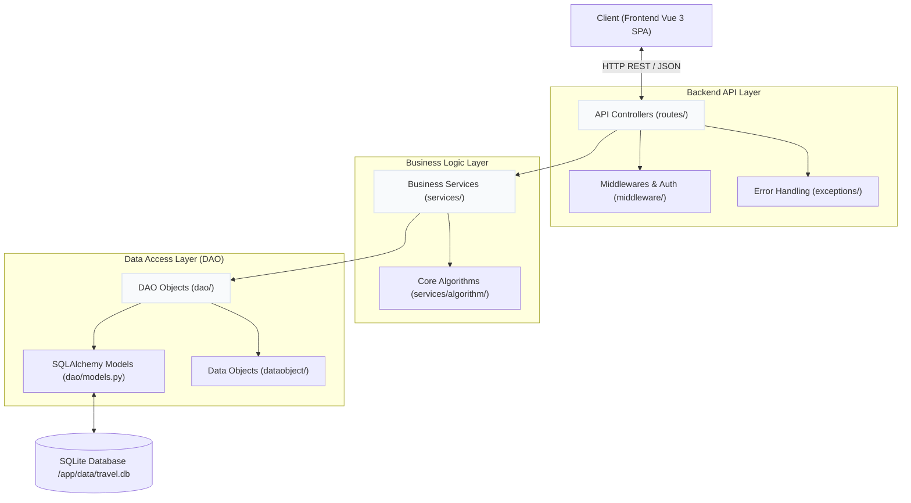
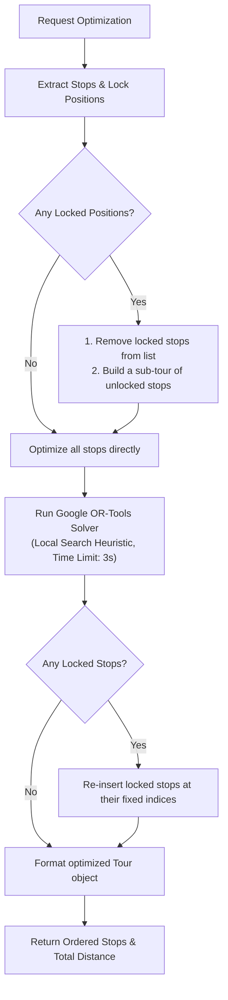
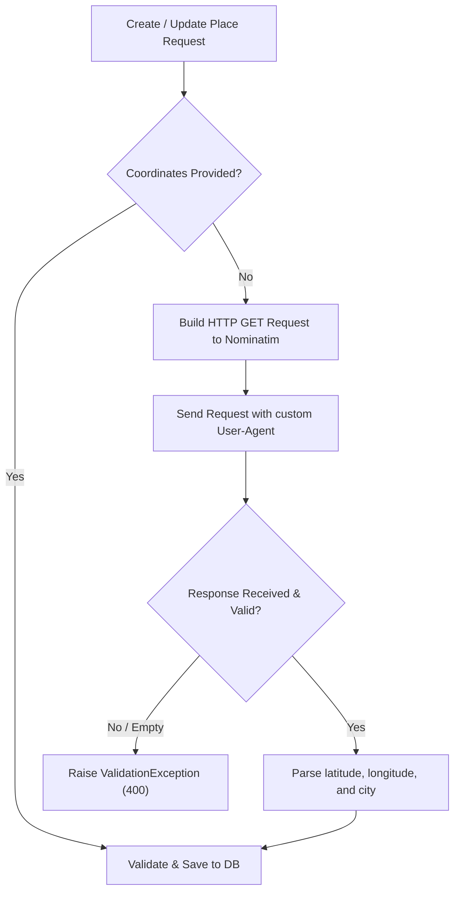
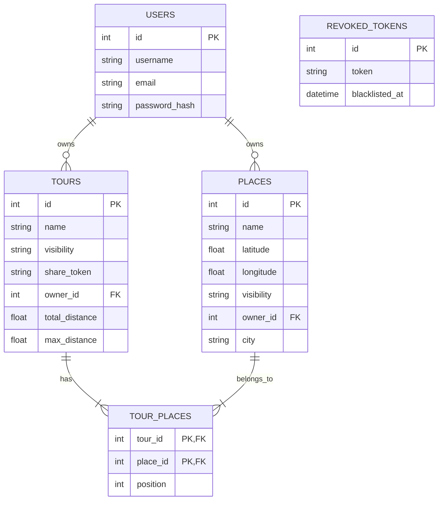

# Technical Documentation — Himeji Planner Backend API

This document provides a comprehensive technical overview of the backend REST API for the **Himeji Planner** application. It details the layered architecture, design patterns, SOLID principles conformance, Traveling Salesperson Problem (TSP) optimization engine, and testing strategy.

> [!NOTE]
> For instructions on how to use the Himeji Planner application features (such as creating/saving tours, editing public/private places, managing hotel clustering loops, etc.), please refer to the **[Application User Guide](../../user_guide.md)**.

---

## 🎯 Technical Interpretations & Design Choices

To satisfy the routing and usability requirements, the backend implementation relies on several key technical decisions:

* **Efficient TSP Optimization (Google OR-Tools)**: Computing the shortest path between multiple locations is a classic **Traveling Salesperson Problem (TSP)**, which is NP-hard. Rather than writing a slow custom brute-force algorithm or naive heuristics, we integrated **Google OR-Tools Routing Solver** (configured with the **Christofides algorithm** for first solution search) to compute highly optimized itineraries within a strict 3-second timeout constraint.
* **Hotel Clustering & Multi-Day Adaptations**: To handle longer trips realistically, the engine solves the "hotel clustering" problem. Sights are clustered around elected hotel bases using a **Greedy Set Cover heuristic** to construct a series of daily round-trips (`Hotel -> Stop -> Hotel`), preventing travelers from having to cover excessive linear distances without returning to a lodging base.
* **Dedicated REST API**: The Flask backend exposes a clean REST API. By separating optimization logic and database management from the user interface, it provides a fast, stateless interface for the frontend application.

---

## 🏛️ System Architecture

The backend is built as a modular **Layered Architecture** using Flask (Python 3.11) and Flask-SQLAlchemy (SQLite). Each layer has a strict boundary of responsibility, promoting testability, maintainability, and clean separation of concerns.



### Architectural Layers

| Layer | Directories | Responsibility | Rules & Boundaries |
| :--- | :--- | :--- | :--- |
| **API / Presentation** | `routes/`<br>`middleware/`<br>`exceptions/` | Processes HTTP requests, deserializes JSON, handles JWT auth, handles routing, and formats responses / errors. | Forbidden to write database queries or raw algorithm logic here. Delegates to **Services**. |
| **Business Logic** | `services/`<br>`services/algorithm/` | Core business logic, coordinate multiple database updates, interface with Nominatim Geocoding, and execute TSP optimizations. | Autonomously orchestrates data flows. Interacts with the database only through **DAOs**. |
| **Data Access (DAO)** | `dao/`<br>`dataobject/` | Defines tables and schemas via SQLAlchemy models. Maps database records to pure Python Data Transfer Objects (DTOs) for the service layer. | Zero knowledge of HTTP. No business validation or network communication. |

---

## 🛠️ SOLID Principles Conformance Audit

The codebase was designed to adhere closely to object-oriented software engineering best practices.

### 1. Single Responsibility Principle (SRP)
Each module has one reason to change:
* **`config.py`** and **`app.py`** configure environment variables and orchestrate initializations, completely decoupled from runtime request processing.
* **`dataobject/`** contains pure Python dataclasses mapping directly to domains.
* **`services/algorithm/distance.py`** performs raw Haversine computations without dependency on network or persistence.
* **`services/algorithm/optimizer.py`** solves the Traveling Salesperson Problem and does not interact with HTTP requests.

### 2. Open/Closed Principle (OCP)
The system is open for extension but closed for modification:
* **Configuration Classes**: `Config` serves as a base class. Environment configurations (`DevelopmentConfig`, `TestingConfig`, `ProductionConfig`) extend it without mutating the parent behavior.
* **TSP Optimizer**: The optimization interface exposes `optimize(places, locked_positions)`. Supporting fixed/locked stops was implemented within the solver without breaking existing signatures or endpoint contracts in the services layer.

### 3. Liskov Substitution Principle (LSP)
Abstractions are interchangeable:
* The generic base DAO (`BaseDAO`) implements generic CRUD workflows (`get_by_id`, `create`, `update`, `delete`). Specialized DAOs (`UserDAO`, `PlaceDAO`, `TourDAO`) subclass it and are substituted transparently in services.

### 4. Interface Segregation Principle (ISP)
Interfaces are lightweight and highly specialized:
* Flask blueprints isolate route groups (`auth_bp`, `place_bp`, `tour_bp`) to prevent routes from importing or depending on unrelated controllers.
* Services expose exact methods corresponding to specific client use cases rather than exposing a broad, unsegregated state.

### 5. Dependency Inversion Principle (DIP)
Dependencies are injected rather than instantiated in-place:
* Services receive their corresponding DAOs via constructor injection, enabling seamless unit testing with mocked databases:
  ```python
  def __init__(self, user_dao: UserDAO = None):
      self.user_dao = user_dao or UserDAO()
  ```

---

## 🧠 Core Optimization Engine (TSP Solver)

The core feature of the Himeji Planner is finding the optimal ordering of places to visit. This is mapped to the **Traveling Salesperson Problem (TSP)** with custom constraints.



### Haversine Distance Formula
To construct the cost matrix for the routing solver, we compute the exact distance between latitude and longitude coordinates on a sphere using the Haversine formula:

$$d = 2r \arcsin\left(\sqrt{\sin^2\left(\frac{\Delta\phi}{2}\right) + \cos(\phi_1)\cos(\phi_2)\sin^2\left(\frac{\Delta\lambda}{2}\right)}\right)$$

Where:
* $\phi_1, \phi_2$ are latitudes in radians.
* $\lambda_1, \lambda_2$ are longitudes in radians.
* $r$ is the Earth's radius (6371 km).

#### Floating-point Safety Correction
In Python, rounding errors on identical points can produce value inputs to `math.acos` or `math.asin` slightly greater than `1.0` (e.g. `1.0000000002`), which crashes with a `ValueError: math domain error`. The solver explicitly bounds the input value before computations:
```python
# Bounded cosine value to prevent mathematical exceptions
cos_val = max(-1.0, min(1.0, cos_val))
```

### Google OR-Tools Routing Engine
The optimizer uses **Google OR-Tools**' routing solver.
* **First Solution Strategy**: Christofides algorithm (provides an initial path with a proven 1.5 approximation ratio for symmetric metric TSPs).
* **Local Search Metaheuristic**: Guided Local Search (GLS) or Tabu Search to escape local minima.
* **Time limit**: Constrained to a maximum of 3 seconds to guarantee prompt HTTP responses.

#### Comparative Benchmarking & Design Decision

During development, we compared Google OR-Tools against a **Nearest Neighbor (NN) + 2-opt local search** heuristic and a **Dynamic Programming (Held-Karp) exact solver**. Detailed reports across various scaling dimensions ($N$) are stored under the `docs/` folder (see [comparison_results.md](comparison_results.md)).

* **Small scales ($N \le 16$)**: The Dynamic Programming solver guarantees absolute mathematical optimality in under 1 second, but its $O(N^2 2^N)$ exponential complexity makes it unusable for larger itineraries.
* **Larger scales ($N \ge 100$)**:
  * At $N = 200$, OR-Tools computes a route of `7172.09 km` in `1.88` seconds, whereas NN + 2-opt takes `2.38` seconds and yields a longer route of `7436.39 km`.
  * At $N = 1000$, OR-Tools resolves in `86.88` seconds (yielding `23723.23 km`) while NN + 2-opt takes `107.37` seconds (yielding `25933.18 km`).

**Conclusion**: Google OR-Tools was selected for production because of its superior scalability, path quality, **flexibility** in handling custom constraints (such as locked positions and hotel clustering), and **ease of implementation** compared to writing and maintaining custom metaheuristic solvers.


### Hybrid Fixed-Index (Lock) Insertion
To allow travelers to freeze/lock specific stops (e.g. reserving a museum at 2:00 PM), the optimizer runs a hybrid pipeline:
1. **Decoupling**: Locked stops are extracted from the list.
2. **Sub-tour Optimization**: OR-Tools calculates the optimal route sequence for the remaining unlocked stops.
3. **Linear Insertion**: Locked stops are re-inserted into the optimized sequence at their exact user-specified indexes. If multiple locks overlap, they are placed sequentially to maintain relative positions without breaking the sub-tour optimality.

### Clustered Hotel Routing (Set Cover Heuristic)
When the user configures a maximum distance between hotels and stops (`max_distance > 0.0`), the system executes a **Clustered set-cover round-trip solver** to determine which stops serve as hotels and how the travel route flows:

1. **Elected Hotels (Set Cover)**:
   * The start/end landmark (index 0) is automatically marked as the first hotel.
   * All interest points within `max_distance` (computed via Haversine) are covered by the start hotel.
   * For remaining uncovered locations, the algorithm uses a **Greedy Set Cover** search: it iteratively elects the point that covers the maximum number of remaining uncovered stops until all points are covered.
2. **Clustering & Round-Trips**:
   * Non-hotel places are assigned to their nearest elected hotel.
   * This partitions the itinerary into distinct hotel sub-clusters: `hotel_round_trips = { hotel_id: [place1, place2, ...] }`.
3. **Global Hotel Pathing**:
   * User-defined step locks are projected onto the hotel sequence.
   * The elected hotels list is optimized via the OR-Tools TSP solver to find the optimal path connecting all hotels.
4. **Itinerary Sequence Generation**:
   * The final itinerary sequence is constructed by walking through the optimized hotel order.
   * For each hotel, the solver appends the hotel itself, followed by a back-and-forth round trip for each assigned place: `[Hotel] -> [Place] -> [Hotel]`.
   * The start hotel is appended at the end to close the global loop.

---

## 🌍 Geocoding Engine (Nominatim Integration)

When creating or updating places in the Himeji Planner, users can optionally specify the coordinates (latitude and longitude) of a location. If coordinates are omitted, the backend dynamically resolves them using the open-source **OpenStreetMap Nominatim Geocoding API**.

### Integration Workflow



### Technical Details

* **API Endpoint**: `https://nominatim.openstreetmap.org/search` (configurable via `GEOCODING_API_URL`).
* **HTTP Method**: `GET`
* **Query Parameters**:
  * `q`: The string query containing the place name.
  * `format`: `json` (to receive a structured JSON response).
  * `limit`: `1` (restricts results to the single most relevant match).
  * `addressdetails`: `1` (ensures structured address attributes like city, town, or suburb are included).
* **User-Agent Requirement**: To comply with Nominatim's Usage Policy (which forbids generic or missing User-Agents to prevent abuse), the backend sends a custom Chrome browser User-Agent header with every request.
* **Fallbacks**:
  * Timeout is set to `10` seconds to avoid locking up thread execution.
  * City parsing fallback: The backend maps the city name by reading the address object in order of specificity: `city` $\rightarrow$ `town` $\rightarrow$ `village` $\rightarrow$ `municipality` $\rightarrow$ `suburb`.
* **Testing & Mocks**: To keep tests deterministic and prevent rate-limiting or network issues during CI/CD, all integration and unit tests mock Nominatim responses using `monkeypatch` on `requests.Session.get`.

---

## 🗄️ Database Schema & Persistence

The application uses SQLite as its default storage engine, configured for robustness and concurrency.

### Schema Relationships



### Database Optimization & Local Persistence
* **Indices**: Index fields like `tours.share_token` and `places.owner_id` are indexed to speed up authorization and lookup checks.
* **Local Persistence**: The database file `travel.db` is stored inside the local filesystem (as defined by the `DATABASE_PATH` environment variable) to persist data between runs.

---

## 🧪 Testing & Verification

The backend code is covered by a test suite using `pytest`.

### Test Architecture

* **Isolated Database Config**: Tests use a separate `TestingConfig` pointing to a clean in-memory database (`sqlite:///:memory:`) or a temporary filesystem database.
* **Fixtures**: Initialized inside `conftest.py` to create the schema, mock third-party services (like Nominatim API geocoding), and register a default seed user and JWT token.
* **Teardown**: Database sessions are rolled back and dropped after every test run to ensure strict isolation.

### Running Tests
To run the test suite locally:
```bash
cd backend
source .venv/bin/activate
PYTHONPATH=. pytest
```

---

## 🚀 Deployment & Local Execution

### Environment Variables
Configure these variables in a `.env` file at the root of the project:

```env
APP_ENV=development
SECRET_KEY=use-a-strong-random-key-in-production
DATABASE_PATH=backend/data/travel.db
```

### Launching the Application
Cross-platform startup scripts are provided at the root of the project to automatically set up virtual environments, install dependencies, seed the database, and launch both services in parallel.

* **Linux / macOS**:
  ```bash
  ./run.sh
  ```
* **Windows**:
  Double-click or run from command prompt:
  ```cmd
  run.bat
  ```

### Automated Startup Workflow
The scripts automate the complete local setup and execution pipeline:

1. **Python Virtual Environment (`.venv`)**:
   * Checks the `backend/` directory for an existing virtual environment.
   * Creates one automatically using `python3 -m venv .venv` (Linux/macOS) or `python -m venv .venv` (Windows) if not found.
2. **Dependency Management**:
   * Installs Python packages from `backend/requirements.txt` inside the virtual environment.
   * Runs `npm install` in `himeji-planner/` to fetch Node.js packages for the frontend SPA.
3. **Database Setup & Seeding**:
   * Runs the `seed_places.py` script. The database file (`travel.db`) is automatically initialized and loaded with 200 public landmarks in France. It skips already-existing places to avoid duplicate rows on subsequent launches.
4. **Parallel Process Orchestration**:
   * **Linux/macOS (`run.sh`)**: Starts the Flask API (port 5000) and Vite SPA (port 5173) as background processes. A trap listener captures `Ctrl+C` (SIGINT/SIGTERM) to kill both processes cleanly at exit.
   * **Windows (`run.bat`)**: Spawns two separate terminal windows (`start cmd /c`) for the frontend and backend, enabling independent logs view and lifecycle management.
