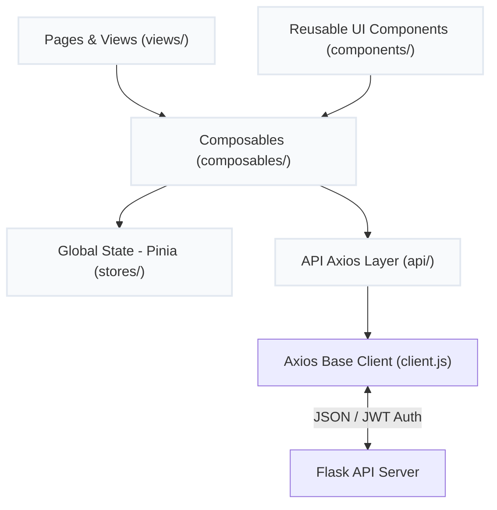
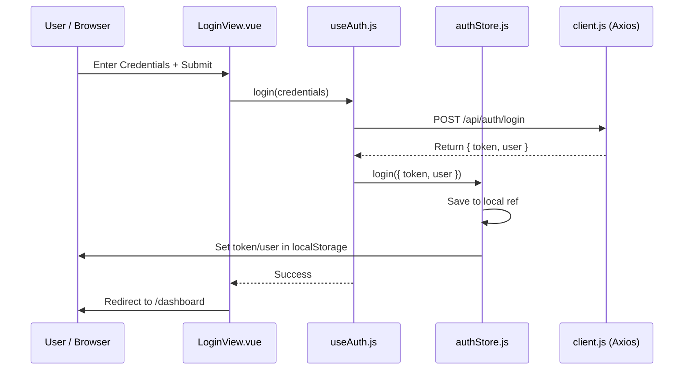

# Technical Documentation — Travel Planner Frontend SPA

This document provides a comprehensive technical overview of the frontend Single Page Application (SPA) for the **Travel Planner** system, built with Vue 3 (Composition API), Pinia, Vue Router 4, and Axios.

---

## 🏛️ Layered Frontend Architecture

The SPA is structured with a strict one-way data flow and separated layer concerns:



### Layer Responsibilities & Rules

| Layer | Responsibility | Forbidden Actions |
| :--- | :--- | :--- |
| **Views (`views/`)** | Route-level layouts, container components, route parameters retrieval. | No direct API calls, no raw business logic or math algorithms. |
| **Components (`components/`)** | Stateless/UI components, rendering data via props, emitting events upward. | Do not access Pinia stores directly (prefer using composables). Never mutate props. |
| **Composables (`composables/`)** | Stateful logic wrapper, coordinates between API calls, local state, and Pinia stores. | No HTML template or rendering logic inside. |
| **Stores (`stores/`)** | Holds and mutates global reactive states (e.g. `auth`, `places`, `tours`). | No direct API client imports or HTTP calls (delegate to composables). |
| **API (`api/`)** | Base Axios client, interceptors, endpoints declaration, error normalization. | No state mutation, no router redirection inside endpoint files. |

---

## 🔑 Authentication & Session Flow

The authentication flow utilizes JWT (JSON Web Tokens) with automated session persistence:



### Route Guards & Axios Interceptor
* **Vue Router Guard**: Configured in `src/router/index.js`. Any route containing `meta: { requiresAuth: true }` verifies the `authStore.isAuthenticated` boolean. Unauthenticated visits are intercepted and redirected to `/login`, appending the destination path as a redirect query parameter.
* **Request Interceptor**: The Axios client (`client.js`) automatically intercepts outgoing requests and appends the authorization header:
  `Authorization: Bearer <token>`
* **Response Interceptor**: In case of a `401 Unauthorized` response (e.g., token expiration), the interceptor automatically calls `authStore.logout()`, clears `localStorage`, and redirects the user to `/login`.

---

## 🎨 Design System & Styling

* **Framework Utilities**: Uses a CSS grid/flex design system with scoped plain CSS for maximum layout flexibility and premium aesthetic controls (gradient buttons, card translations, hover transforms).
* **Base Components**: Exposes atomic UI controls under `components/ui/` (`BaseButton`, `BaseInput`, `BaseModal`, `BaseSpinner`, `AlertBanner`) ensuring consistent styling throughout the application.

---

## 🔄 Core Features & Interactive Mechanics

### 1. Drag & Drop Stop Reordering (`TourEditModal.vue`)
The route Stops editor implements native HTML5 drag and drop to re-order itinerary checkpoints:
* **Events**: `dragstart`, `dragover`, `drop`, and `dragend` handle positions mutation.
* **Optimized Rendering**: Stops are tracked by a unique reactive reference key (`_uid`) containing their database ID and array index to prevent animation flashes during re-indexing.
* **Manual vs. Solver Save**:
  * **Manual Order**: If the user modifies coordinates manually without checking "Optimize", a `PATCH` payload is sent with the exact ordered stop list and `optimize: false`.
  * **Optimized Solver**: If "Optimize" is checked, the backend re-calculates the TSP route using the locked stops as fixed anchor constraints.

### 2. Broken Hotel Connections Analysis
To ensure safety constraints (max distance between hotel stops), the editor monitors connection breaks:
* On initialization, each hotel stop's preceding stop is recorded.
* If a stop deletion or drag-and-drop operation breaks the connection between a hotel and its original predecessor, the hotel card is highlighted in red on the UI. This provides immediate visual feedback to the user before they submit changes.

### 3. Quick Stop Add Panel
Below the stop list is an interactive search input to add new stops:
* **Dropdown Filter**: Triggers a live search against all loaded public and private places.
* **Added Indicators**: Places already present in the tour show a green checkmark `✓ Added` and are disabled from being clicked, preventing duplicates.
* **Instant Insertion**: Clicking a non-added place appends it to the end of the tour stops list.

---

## 🗄️ State Management Layout

The Pinia stores use the **Setup Store** syntax:

### `placesStore.js`
Manages the array of loaded landmarks:
* `places`: A reactive list of all visible places.
* `loading` & `error`: State properties to render spinners and banner alerts.
* `updatePlace`: Inserts or replaces a modified place inline within the reactive array.

### `toursStore.js`
Manages itineraries:
* `myTours`: List of all tours created by the current user.
* `publicTours`: List of public tours created by other travelers.
* `removeTour`: Filters out a deleted tour by its ID, updating the UI instantly.

---

## 🚀 Running & Building

### Launching the Application (Recommended)
You can launch both the frontend and backend simultaneously using the cross-platform automated startup scripts located at the root of the project:

* **Linux / macOS**:
  ```bash
  ./run.sh
  ```
* **Windows**:
  Double-click or run from command prompt:
  ```cmd
  run.bat
  ```
These scripts will automatically verify Python/Node.js dependencies, seed the database, and spin up both dev servers in parallel.

### Manual Frontend Execution
If you wish to run the frontend independently:

1. **Install Dependencies**:
   ```bash
   cd himeji-planner
   npm install
   ```
2. **Launch Dev Server**:
   ```bash
   npm run dev
   ```
   The site will be hosted on `http://localhost:5173`.
3. **Compile for Production**:
   ```bash
   npm run build
   ```
   Static files are outputted to the `dist/` directory.
